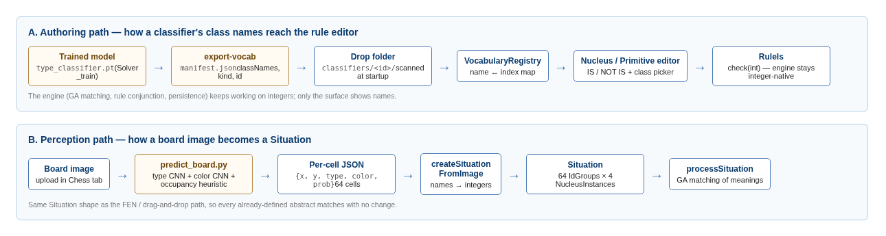
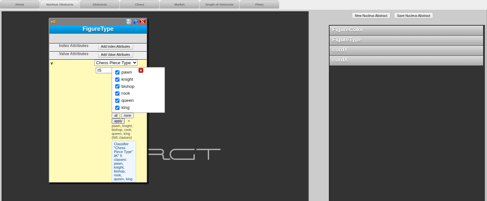
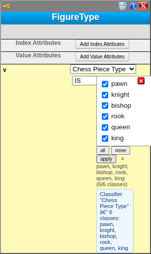
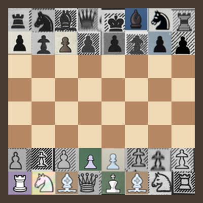
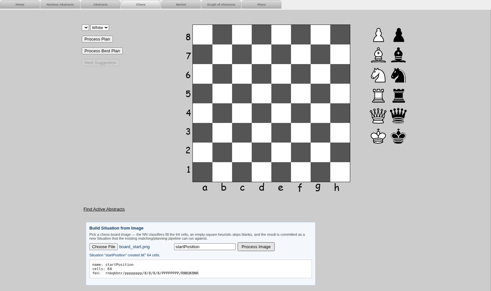

# Guidance for NN Classifier Integration in the RGT Solver

*Companion to the "12Oct2016 User Guide for RGT" — read that guide first if you are not
familiar with nucleus, primitive and composite abstracts. Technical background is in
[NN_CLASSIFIER_INTEGRATION_PLAN.md](NN_CLASSIFIER_INTEGRATION_PLAN.md) and
[NN_INTEGRATION_PAPER_DRAFT.md](NN_INTEGRATION_PAPER_DRAFT.md).*

## Introduction

This document aims to cover the description of how to train, place and use neural-network
(NN) classifiers within the RGT Solver, so that the values of nucleus abstracts are no
longer bare integers (e.g. `6` for the king) but the names the classifiers themselves were
trained on (`king`, `white`, …). It also describes how a chess board **image** is turned
into a Situation through these classifiers, and — honestly — which parts of that pipeline
are already working and which parts are still missing and should be added.

The guidance is designed for users who have fulfilled the exercises of the 2016 guide,
i.e. who can already define the 4 chess nucleus abstracts (`cordX`, `cordY`, `FigureType`,
`FigureColor`) and derive primitive/composite abstracts from them.

Current development:

- Rendering the image-recognized Situation back onto the chess board tab (not there yet).
- Replacing the hardcoded name→integer mapping in the perception bridge with the
  vocabulary registry (not there yet).
- Learned occupancy ("empty square") classification instead of a brightness heuristic.

## 1. The idea: NN classifiers as nuclear vocabularies

Recall from the 2016 guide that a nucleus abstract carries a value attribute with a
condition such as `IN [0,6]`, and that the chess extension fixes the meaning of these
integers: FigureType `0`=Dummy, `1`=Pawn … `6`=King; FigureColor `0`=Dummy, `1`=White,
`2`=Black. The problem is that the integer encoding lives only in the user's head — the
interface never tells you that the king is `6`, and if a retrained classifier reorders its
classes, every saved abstract silently changes meaning.

The integration solves this by attaching a **vocabulary** — the ordered class-name list of
a trained NN classifier — to a nucleus abstract. Two new condition operators appear next
to `=`, `!=`, `IN`:

- **IS** — the attribute's value is one of the listed *class names*
  (e.g. `IS knight, bishop` defines a *minor piece*);
- **NOT IS** — the negation.

Note that the Solver's engine (matching, inheritance, the GA) still works on integers —
`IS king` is internally the same as `= 6`. Only the *surface* changes: you pick names, the
manifest of the classifier says which index each name has, and the Solver does the
translation. This is why everything you learned about primitive/composite/set/action
abstracts continues to work unchanged: complex abstracts of any level are still composed
from the same nucleus conditions, they just may now *refer* to the classifier's classes by
name.



*Figure 0. The two data paths. Path A brings the classifier's class names into the rule
editor; path B brings a board image into a Situation through the same classifiers.*

## 2. Where to place a model (the classifier drop folder)

A classifier becomes visible to the Solver by placing one folder with a `manifest.json`
into the **drop folder**. Nothing else — no code change, no DB migration.

```text
<Solver Root>/
  classifiers/                      <- the drop folder (scanned at webapp startup)
    type_classifier/
      manifest.json                 <- required: id, kind, classNames
      type_classifier.pt            <- optional: the checkpoint itself
    color_classifier/
      manifest.json
    neighborhood_detector/
      manifest.json                 <- kind: "relation" — listed, but not pluggable yet
  Solver_train/
    predict_board.py                <- image -> per-cell JSON bridge (Section 5)
    chess_piece_classifier.py       <- training + shared inference helpers
    artifacts/
      type_classifier.pt            <- the manifests' checkpointPath points here
      color_classifier.pt
```

The drop folder is resolved in this order (first hit wins):

1. JVM property `-Dsolver.classifiers.dir=<path>`
2. environment variable `SOLVER_CLASSIFIERS_DIR`
3. `./classifiers` under the working directory

A minimal manifest looks like this:

```json
{
  "schemaVersion": 1,
  "classifierId": "type_classifier",
  "displayName": "Chess Piece Type",
  "kind": "categorical",
  "classNames": ["empty", "pawn", "bishop", "knight", "rook", "queen", "king"],
  "suggestedPrimitiveTypeName": "FigureType",
  "checkpointPath": "../../Solver_train/artifacts/type_classifier.pt"
}
```

- `classNames` is **authoritative**: the position in this list *is* the integer the engine
  will use — a plain 0-based mapping, with no offset applied anywhere. This matters for
  the chess nuclei, which reserve `0` for the Dummy value: a piece-only class list
  (`pawn` … `king`) would put `pawn` on `0` (= Dummy) and `king` on `5` (= Queen). The
  shipped manifests therefore declare the reserved slot explicitly as a synthetic class
  at index 0 — `["empty", "pawn", "bishop", "knight", …, "king"]` and `["none", "white", "black"]` — so that
  `IS king` resolves to `6` and `IS white` to `1`, matching the 2016 convention. Keep this
  entry when regenerating a manifest with `export-vocab` (see Section 7.1).
- `kind: "categorical"` classifiers are pluggable into a nucleus. `kind: "relation"`
  (e.g. the Siamese neighborhood detector) and `"regression"` are listed by the interface
  but cannot be bound to a nucleus yet.
- `suggestedPrimitiveTypeName` lets the editor auto-select this classifier when you open a
  nucleus with a matching name — this is why `FigureType` opens with "Chess Piece Type"
  already picked.

You do not need to write the manifest by hand: after training (Section 4) run

```bash
python Solver_train/chess_piece_classifier.py export-vocab \
  --checkpoint Solver_train/artifacts/type_classifier.pt \
  --output-dir classifiers/type_classifier --copy-checkpoint
```

and restart the webapp. In the log you shall see:

```text
INFO: VocabularyRegistry: loaded 'type_classifier' (7 classes).
INFO: VocabularyRegistry: loaded 'color_classifier' (3 classes).
```

Note that a malformed manifest is logged and skipped — it never blocks the startup.

**Docker.** The provided `docker-compose.yml` bind-mounts the host `./classifiers` folder
read-only into the container and the Dockerfile sets
`SOLVER_CLASSIFIERS_DIR=/opt/solver/classifiers` and
`SOLVER_TRAIN_DIR=/opt/solver/Solver_train`. So on a container you place models exactly the
same way, on the host, and restart with `docker compose restart app`.

## 3. Using a classifier in the interface

### 3.1 In the nucleus abstract editor

In the "Nucleus Abstracts" tab click on the abstract name (e.g. `FigureType`) in the right
side list. Within the opened skeleton, for the value attribute:

1. Click once anywhere on the value-attribute line — the classifier combo-box gets
   populated from the registry (it loads lazily, on the first click). If the nucleus name
   matches a classifier's `suggestedPrimitiveTypeName`, that classifier is selected
   automatically.
2. Select the classifier from the combo-box, e.g. "Chess Piece Type". A blue banner
   appears underneath listing its classes, so you finally *see* the encoding you are
   working with.
3. Select the **IS** (or **NOT IS**) operator from the operators combo-box.
4. A checkbox list with the class names appears in place of the value box. For a nucleus
   it starts with *all* classes selected — the natural reading "the value can be any
   output of this classifier". Use the `all` / `none` buttons, tick what you need and
   click `apply`. The committed selection is shown next to the list.
5. Save the abstract with the same old floppy diskette image (still the same floppy as in
   2016, and we still hope you know how they used to look like).



*Figure 1. The `FigureType` nucleus in the editor: classifier "Chess Piece Type" picked,
operator IS, all six classes ticked.*



*Figure 2. Close-up: the classifier combo-box, the IS operator, the class checkboxes with
`all`/`none`/`apply`, the committed preview and the classifier banner.*

### 3.2 In the primitive abstract editor

The primitive editor mirrors the same controls. Derive a primitive from a
classifier-bound nucleus (like you derived `cordXGr4` from `cordX` in 2016), and
strengthen the condition *by names*: select operator IS and tick only the classes you
want. Unlike a nucleus, a primitive starts with an *empty* selection — you are pinning it
to specific classes on purpose.

On save, the stored JSON keeps the *names* and the classifier id
(`{"oper": "IS", "value": "king", "classifier": "type_classifier"}`), so a retrained
classifier with reordered classes produces a detectable mismatch instead of a silent
meaning flip.

Note that abstracts saved before the classifier id was persisted are rescued at load time:
if an IS rule arrives without a classifier, the Solver matches its value tokens against
all registered vocabularies and re-binds when the match is unique (an INFO log line asks
you to re-save the concept to make the binding explicit).

**Exercise:**

1. Open `FigureType`, bind "Chess Piece Type" as on Figure 1, keep IS with all classes,
   and save.
2. Define a primitive abstract `King` derived from `FigureType` with the condition
   `IS king`. Note that this is the same abstract you would earlier write as `= 6` — check
   in the saved JSON that both the name and the classifier id were stored.
3. Define a primitive abstract `MinorPiece` derived from `FigureType` with
   `IS knight, bishop` (comma-separated names work exactly like the `=` value lists of the
   2016 guide).

## 4. Training the models (what Solver_train gives us)

The training side lives in `Solver_train/` and contains **two** independent projects for
figure type and color classification. Both were reviewed; here is what each provides and
how each maps onto the Solver conventions.

### 4.1 Solver_train — CNN classifiers (the integrated family)

`Solver_train/chess_piece_classifier.py` trains two transfer-learned CNNs (ResNet-18 by
default, 128×128 RGB input) from per-square crops laid out in class folders (`wP/ … bK/`).
The dataset that produced the shipped checkpoints is included under
`Solver_train/data/piece_crops/`:

```bash
python chess_piece_classifier.py train --data-dir ./data/piece_crops --output-dir ./artifacts \
  --epochs 15 --batch-size 32 --img-size 128 --arch resnet18   # add --device cpu if no GPU
```

| Artifact | Classes | Validation accuracy |
|---|---|---|
| `type_classifier.pt` | pawn, knight, bishop, rook, queen, king | 1.00 (905 held-out samples) |
| `color_classifier.pt` | white, black | 1.00 (905 held-out samples) |

The checkpoints carry `class_names` inside, which is what `export-vocab` (Section 2) turns
into the manifest. The same folder also trains the Siamese neighborhood detector — see
Section 4.3.

Note that the trained `.pt` files live in `Solver_train/artifacts/` — this is where the
manifests' `checkpointPath` points to. The training metrics quoted above come from
`Solver_train/artifacts/training_summary.json`; the dataset description is in
`Solver_train/docs/TRAINING_SUMMARY.txt`. Keep in mind that the Docker build does not yet
ship these checkpoints by itself — see Section 7.1.

### 4.2 Solver_new_26 — lightweight prototype classifiers (candidate, not yet integrated)

The second project lives in the same `Solver_train/` top folder, under
`Solver_train/Solver_new_26/` — a parallel implementation of the same figure shape and
color detection task (package `chess_attr`, per the specification PDFs shipped next to
it). It trains *prototype/centroid-based* classifiers — no deep learning, JSON model
artifacts, CPU-instant:

| Model | Classes | Remark |
|---|---|---|
| `color_model.json` | `0` none, `1` side-A, `2` side-B | **matches the Solver's FigureColor 0/1/2 convention natively** |
| `type_model.json` | none, pawn, knight, bishop, rook, queen, king | **7 classes — includes the Dummy/empty class at index 0**, exactly the FigureType 0..6 range |
| `type_model_6class.json` | the 6 pieces | piece-only variant |
| `x_model.json`, `y_model.json` | 1..8 | axis classifiers; deterministic mode recommended |

This family is attractive precisely where the CNN family has gaps: it covers **all four**
chess nuclei (including coordinates), and it *has* an "empty square" class, so no
occupancy heuristic is needed. Its `infer_board.py` also supports perspective warp from
corner annotations (`warp_and_crop.py`), which the CNN pipeline lacks.

Note that based on the x/y axis models, the coordinate nuclei `cordX` / `cordY` can be
integrated the very same way as figure type and color — the manifest format does not care
what the classifier is, only that it is categorical. A small manifest with
`classNames: ["1" … "8"]` and `suggestedPrimitiveTypeName: "cordX"` (resp. `cordY`) makes
the coordinates pickable by name in the editor; the paper draft explicitly lists
coordinate classifiers in the design envelope. Two practical remarks:

- **Index alignment.** A vocabulary maps a name to its *position* in `classNames`, so
  `"1"` at position 0 would resolve to integer `0` while the existing `cordX` rules use
  values 1..8. Prefix a placeholder entry at index 0 (the same trick the plan prescribes
  for the `empty` class of FigureType) so that name `"1"` lands on integer `1`.
- **Perception side.** After the 8×8 grid split the coordinates are known
  deterministically from the cell position (this is also what `Solver_new_26` itself
  recommends — deterministic mode for production). So the learned x/y models are not
  required for the image pipeline; their value is the authoring surface and, optionally,
  cross-checking the grid geometry.

What is missing to actually use it in the Solver (nothing conceptual, only plumbing):

- no `manifest.json` export for the JSON models (the manifest format is
  framework-agnostic, so this is a small script);
- `predict_board.py` only knows how to load `.pt` checkpoints — a loader branch for the
  `chess_attr` JSON models (or a parallel `predict_board` entry in `Solver_new_26`
  emitting the same per-cell JSON) is needed;
- accuracy of the prototype models on the shared datasets should be evaluated and recorded
  in the manifest's `trainingMetadata` before replacing the CNNs.

Recommendation: keep the CNN family as the recognition backbone and adopt from
`Solver_new_26` (a) the `none`/empty class idea for occupancy and (b) the corner-based
warp for real photographs.

### 4.3 Neighborhood detector — trained and registered, waiting for its hook

The Siamese relation network (`Solver_train/chess_neighborhood_detector.py`) takes two
64×64 square crops and answers `neighbor` / `not_neighbor`. Although it is not used by the
pipeline today, the **trained models are available** in the same top folder:

```text
Solver_train/artifacts/
  neighborhood_detector.pt            <- best checkpoint (val. accuracy 0.839)
  neighborhood_detector_epoch005.pt   <- epoch snapshots
  neighborhood_detector_epoch010.pt
  neighborhood_detector_epoch015.pt
  checkpoints_summary.json            <- per-epoch train/val metrics
```

It is already registered in the drop folder (`classifiers/neighborhood_detector/`,
`kind: "relation"`, with real `trainingMetadata`), so the interface lists it — it is only
not *pluggable* into a nucleus, because a relation is a statement about **two** instances
while a nucleus rule checks one value. When needed, it plugs in at two places:

1. **Perception-side grid verification (the near-term use).** In `predict_board.py`,
   after the 8×8 split, run the detector over pairs of adjacent cell crops; if adjacent
   pairs do not classify as `neighbor`, the board box / warp is wrong and the Situation
   should not be committed. This is a self-contained change inside the Python bridge —
   the Java side needs nothing.
2. **Authoring-side relation predicate (the future use).** At the AR1/composite level a
   relation classifier could back a two-attribute condition (e.g. "cellA is adjacent to
   cellB") the same way a categorical classifier backs a nucleus IS rule. This is the
   composite-rule surface listed as future work in the paper draft — designed, not built.

## 5. From an image to a Situation

This is the perception half (path B on Figure 0). It is available in the **Chess tab**
under the board: the "Build Situation from Image" panel.

1. Make sure the 4 chess nucleus abstracts are defined (they are the ones the recognized
   cells will instantiate — without them the action reports an explanatory error).
2. Click "Choose file" and pick a board image; optionally type a Situation name.
3. Click **Process Image**. The server shells out to `Solver_train/predict_board.py`,
   which crops the 8×8 grid, runs a brightness-variance occupancy check per cell (flat
   cell ⇒ empty), and the type + color CNNs on the occupied cells.
4. The per-cell results come back as `(x, y, type, color, probability)`, the bridge
   `SituationManager.createSituationFromImage()` maps names to the chess integers and
   builds one IdGroup with 4 NucleusInstances per cell — exactly the shape the FEN and
   drag-and-drop paths produce. The Situation is registered in the situation library and
   the panel prints its name, cell count and FEN.
5. The recognized position is then **drawn onto the chess board**, and the meaning
   matching runs automatically. The status line reports how many abstracts activated;
   select one in the combo-box and press **Show Next Instance** to walk through the
   figure compositions that activated it, highlighted directly on the board — the same
   interaction the 2016 guide describes for a hand-placed situation.



*Figure 3. A test board composed from training-distribution square crops (start
position).*



*Figure 4. The Chess tab after processing Figure 3: 64 cells committed, and the FEN line
`rnbqkbnr/pppppppp/8/8/8/8/PPPPPPPP/RNBQKBNR` — the start position was reconstructed with
all 32 pieces correct.*

The recognized Situation is immediately processable by the existing meaning base: it is
registered as the *last* situation, so triggering
`processSituation.action?situationName=<name>` (or with an empty name) runs the GA
matching over it and returns the activated abstracts, the same way "Find Active
Abstracts" does for the board. This was verified on the Figure 3 board.

**Exercise:**

1. Define the 4 chess nuclei (2016 guide, exercise 1), restart the webapp, and process any
   rendered board image through the panel. Check that the FEN corresponds to the picture.
2. Define the `Figure` and `Pawn` AR1 abstracts (2016 guide) and process the image again
   via `processSituation.action` — make sure the pawns of your image activate `Pawn`.

Note that the first call after a restart takes ~10–20 s: the Python subprocess imports
torch and loads two checkpoints per invocation (see Section 7.3).

## 6. Passing classifiers up the complexity levels

Nothing new has to be learned here, and that is the point of the design. The nuclear level
is the *only* place where values (hence classifiers) live; every higher level — primitive,
AR1, composite, set, action, virtual abstracts and their polymorphic specifications —
strengthens or composes those same nucleus conditions, exactly as described in the 2016
guide. So:

- `King` (primitive) = `FigureType IS king`;
- `Figure` (AR1) composes classifier-bound `FigureType`, `FigureColor` with `cordX`,
  `cordY`;
- `WhiteKing` (AR1/composite) specifies `FigureType IS king` and `FigureColor IS white`;
- `FieldUnderCheck` and its virtual specifications work unchanged — when you specify the
  attacker's figure type, you may now write `IS pawn` instead of `= 1`;
- Sets and Actions consume these abstracts without ever seeing a class name — by the time
  matching happens everything is integers again.

Note the intended division of labor: **NNs answer only nuclear-level questions** ("what
figure is in this crop?"), while relations between the answers (protection, check, plans)
remain symbolic abstracts. Relation NNs — the neighborhood detector is the first example —
would plug in at the AR1/composite level; that surface is designed but not built (it is
the "composite-rule integration" future-work item of the paper draft).

## 7. What is missing and should be added

This section lists, honestly, the gaps found while reviewing the whole project. Items are
ordered roughly by importance.

### 7.1 Packaging / deployment

- **The Docker image does not ship the type/color checkpoints.** The Dockerfile copies
  `predict_board.py`, `chess_piece_classifier.py` and only the *neighborhood* checkpoint;
  `type_classifier.pt` / `color_classifier.pt` must exist in
  `Solver_train/artifacts/` at build time. Until the two `COPY` lines (or better, a
  checkpoint mount like the classifiers mount) are added, image-to-situation works only
  when the artifacts are mounted or pre-copied. The trained `.pt` files are already in
  place in `Solver_train/artifacts/`, so the manifests' `checkpointPath` resolves — only
  the Docker `COPY` step is missing.
- The `trainingMetadata.note` in both manifests still says "placeholder — regenerate with
  export-vocab"; regenerate them from the real checkpoints so drift detection has real
  producer/timestamp data.
- **`export-vocab` does not know about the reserved Dummy slot.** It writes the model's
  own `class_names` verbatim, i.e. the 6 piece classes / 2 colour classes. Re-running it
  over the chess manifests silently re-introduces the off-by-one described in Section 2
  (`IS king` would then test for Queen). Until the exporter learns a
  `--reserve-index-0 <name>` option, re-add the synthetic `empty` / `none` entry by hand
  after regenerating, and verify with
  `curl "http://localhost:8080/getVocabulary.action?classifierId=type_classifier"`.
- **The image's WAR lags the source tree.** The web assets baked into the prebuilt image
  predate the jQuery-1.5.2 fix for the image-upload button, so a container started from
  the image alone has a *silent* "Process Image" button. `run-solver.sh` starts the stack
  and pushes the current `WebContent/` assets in; a full `docker compose build` also
  resolves it.

### 7.2 Perception bridge (SituationManager)

- **The name→integer mapping is hardcoded** (`chessFigureCodeFromName()`:
  pawn=1 … king=6, white=1, black=2) instead of asking `VocabularyRegistry`. It works, and
  it matches `Situation.identifyFigure()`, but it re-introduces exactly the drift risk
  (P3) the vocabulary layer was built to remove. The intended fix from the plan: prefix a
  synthetic `empty` class at index 0 of each occupancy-carrying vocabulary and resolve
  `m_value = vocabulary.indexOf(name)`.
- **Confidence is dropped.** `predict_board.py` reports per-cell probabilities; the bridge
  keeps only the argmax. A per-instance confidence side-channel (and a low-confidence
  warning in the panel) is future work.
- The temporary image and the subprocess have no timeout; a stuck Python process would
  hang the request thread.
- **Knight/Bishop encoding — resolved.** The 2016 chess-tab convention fixes FigureType as
  Pawn(1), **Bishop(2), Knight(3)**, Rook(4), Queen(5), King(6); the board sprites in
  `ChessSituation.css` and the legacy abstracts (`FieldUnderCheckOfKnight` uses `ft = 3`)
  both follow it. `Situation.identifyFigure()` and the bridge's
  `chessFigureCodeFromName()` originally used the *FEN* order (knight=2, bishop=3), so an
  image-recognized knight was stored as a bishop as far as the board and every legacy
  abstract were concerned. All three are now aligned on the 2016 order: the two Java
  methods were swapped and the `type_classifier` manifest declares
  `["empty","pawn","bishop","knight","rook","queen","king"]`. Note the manifest
  deliberately re-orders the CNN's own `class_names` — inference maps class *names*, never
  indices, so this is safe; but it is a second reason never to blindly regenerate the
  manifest with `export-vocab`.

### 7.3 Occupancy and geometry

- **"Empty" is a heuristic, not a learned class.** A brightness-variance threshold
  (`--occupancy-var-threshold`, default 120) decides emptiness; it works on rendered
  boards, but textured squares/photos will fool it. Closing options: retrain the type CNN
  with a 7th `empty` class, or adopt `Solver_new_26`'s 7-class type model (Section 4.2).
- **The board box is a centered square guess** (92% of the smaller image side). Photos
  taken at an angle need corner detection + perspective warp — `Solver_new_26`'s
  `warp_and_crop.py` already implements the warp given corners.
- **The Siamese neighborhood detector is not wired in.** It is meant to verify the 8×8
  grid geometry before committing a Situation; today it is only listed in the registry,
  although its trained checkpoints are ready in `Solver_train/artifacts/` — see
  Section 4.3 for the two intended hook points.
- Each request spawns a fresh Python process (~10–20 s on CPU). A small persistent sidecar
  (kept warm, same JSON contract) is the planned Phase D follow-up.

### 7.4 Interface

- ~~The recognized Situation is not rendered back onto the chess board.~~ **Implemented.**
  "Process Image" now draws the recognized position onto the board (`renderFenOnBoard()`
  in `chessSituation.js`, driven by the FEN in the response) and then runs the matching,
  so the actives list and "Show Next Instance" work exactly as for a hand-placed board.
  The mapping is exact because the image bridge numbers its IdGroups 1..64 in the same
  row-major order (a8 first) that `showActiveInstance()` uses to index board cells.
- The classifier picker of a *saved* concept populates only on the first click on the
  attribute row (lazy load), and the saved operator is prepended as a stray option into
  the classifier combo-box by the legacy list renderer — cosmetic, but confusing.
- The em-dash in the panel status renders as `—` because the pages are served as
  ISO-8859-1 — cosmetic encoding mismatch.
- The composite abstract editor does not offer IS / NOT IS on nucleus attributes yet; you
  strengthen by names in a primitive first and use that primitive in the composite (plan
  §8.1).

### 7.5 Engine-side quirks observed while verifying this guide

- **After "Initialize DB" (or Undump), restart the webapp before processing situations.**
  The GA keeps nucleus roots keyed by the old `PrimitiveType` objects, and processing a
  new Situation fails with "There is no Node registered for the given NucleusType" until a
  restart reloads everything consistently.
- Three integration bugs were found and fixed in the working tree during this review:
  `predict_board.py` called `generate_grid_regions()` with the old 5-argument signature
  and expected an `index` key the regions no longer carry (two API-drift bugs against
  `chess_piece_classifier.py`), and the image panel's button handler used
  `$(document).on(...)`, which does not exist in the bundled jQuery 1.5.2 — the button
  silently did nothing. All three are required for Section 5 to work.

## 8. Appendix: running the verified end-to-end demo

The whole Section 5 flow was verified inside the provided Docker setup:

```bash
# 1. check the checkpoints are in Solver_train/artifacts/ (see 7.1 — the Dockerfile
#    does not ship them yet, so they must be present / mounted at run time)
ls Solver_train/artifacts/type_classifier.pt Solver_train/artifacts/color_classifier.pt

# 2. start (classifiers/ is bind-mounted by docker-compose.yml)
docker compose up -d

# 3. define the 4 chess nuclei in the UI (or Initialize DB + restart, see 7.5)

# 4. Chess tab -> Build Situation from Image -> pick a board image -> Process Image
#    expected: Situation created, 64 cells, correct FEN

# 5. run the meaning matching over it
curl "http://localhost:8080/processSituation.action?situationName=<name>"
```

The classifier registry itself can be checked without the UI:

```bash
curl http://localhost:8080/listClassifiers.action   # all registered classifiers
curl "http://localhost:8080/getVocabulary.action?classifierId=type_classifier"
```
